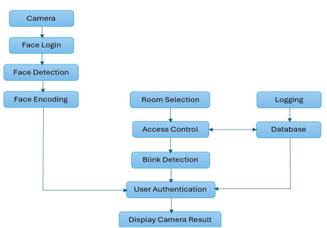
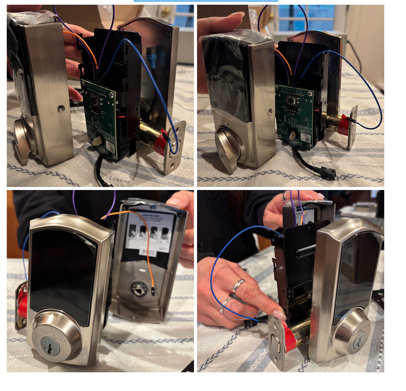

# Zero Trust Dual Authentication System  
*Senior Design Project – Cal Poly Pomona (ECE)*

 
 


## Overview
This project implements a **dual-factor smart access control system** that combines facial recognition with username/password verification, reinforced by **Role-Based Access Control (RBAC)** and **Attribute-Based Access Control (ABAC)**.  
The system aligns with **Zero Trust principles**, ensuring every access attempt is continuously verified through both biometric and credential checks.

## System Diagram & Prototype

<p align="center">
  
</p>
<p align="center">
  <em>End-to-end flow from camera to access control and logging.  
<p align="center">
  
</p>

<p align="center">
  <em>Hardware prototype with Kwikset lock controlled over UART.</em>
</p>


## Features
- **Two-Factor Authentication:** Facial recognition + credential entry (username/password).  
- **Role-Based Access:** Access permissions tied to roles in an SQLite database.  
- **UART Lock Control:** Kwikset smart lock connected via USB-to-serial interface.  
- **Liveness Detection:** Blink detection prevents spoofing with photos or videos.
- **Local Processing:** Runs entirely on a laptop — no cloud services required.  

## System Architecture
Laptop (Python, OpenCV, dlib)
  - Facial Recognition
  - Blink Detection
  - Credential Verification (SQLite Database)
  - UART Serial Interface
  - Kwikset Smart Lock

## Repository Structure

<pre> SDP/ 
  ├── main.py # Main entry point 
  ├── kwikset.py # UART communication with Kwikset lock 
  ├── requirements.txt # Python dependencies 
  ├── /docs # Poster, diagrams, screenshots 
  ├── /src # Supporting scripts/modules 
  └── README.md # Project documentation </pre>

## Files Not Included
For security and privacy reasons, the following files are not tracked in this repo:  
- **Images/** → Facial images for recognition. Create your own dataset structured by user folders.  
- **Databases (`*.db`)** → Generated automatically at runtime.  
- **Model File** → Download `shape_predictor_68_face_landmarks.dat` (~95MB) from the [dlib model zoo](http://dlib.net/files/shape_predictor_68_face_landmarks.dat.bz2).  
- **Secrets** → `serviceAccountKey.json` and other credentials must remain private.  
- **Cache/Environment** → `__pycache__/`, `.DS_Store`, `venv/`.  

## Installation
1. Clone the repo:
   ```bash
   git clone https://github.com/nheckers/SDP.git
   cd SDP
2. Install dependencies:
   ```bash
   pip install -r requirements.txt
3. Download the dlib model and place it in the project root.

## Usage
1. Add you own face images under created folder **Images/**
2. Run the program:
   ```bash
   python main.py
3. Enter a username and password when prompted.
4. If both facial recognition and credentials match role permissions, the system sends a UART unlock signal.

## Results
- **Successful Access:** Correct face + credentials + role → access granted.
- **Unauthorized/Unknown User:** Incorrect credentials or unknown face → access denied.
- **Role Restriction:** Valid user, but insufficient role privileges → access denied.
- **Spoof Attempts:** Printed/static images blocked via blink detection → access denied.

## Future Work
- Develop a GUI for easier user management and access logs  
- Expand to multi-factor authentication (e.g., fingerprint, RFID)  
- Improve facial recognition under low-light conditions  

## Credits
- Contributors: Hadas Ben-Noun, Audry Molinari, Nick Heckers, Victor Mendoza  
- Advisor: Dr. Valerio Formicola, Cal Poly Pomona (ECE)  

  

  
   
